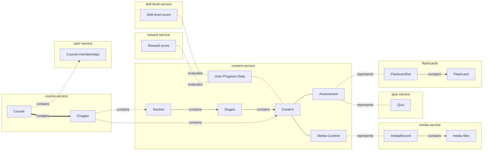

# Deletion Concept

Whenever data is deleted, all dependent object need to be updated or removed. In a distributed system, data is spread out over different components (in our case different services) making the deletion of data more challenging and expensive. 

## Data Dependencies



In our system, data dependencies can be abstracted into three levels. The top level is the course level. A course contains a set of members and an array of chapters, which are divided into sections and contain content. Whenever a course is removed, all memberhsips, chapters, sections,and content need to also be removed.

The second level can be described as the content level. Content is grouped into Stages that make up a section. For all content, a user can track progress. On basis of tracked progress, a reward-score and skill-level-scores are calculated for each individual member of a course. When a user is deleted or leaves a course, all user data located in the reward-, skill-level-,and content-service are to be removed for the course (or all if user is deleted completely).

On the final level we can cover all different kinds of content. Currently we support media content and two assessment types: flashcard sets and quizzes. Whenever an assessment is deleted, the corresponding flashcard set or quiz needs to also be removed. Meanwhile media can be re-used in different courses, meaning if media content is removed, the link in the mediarecords on the media-serive need only to be updated and not necessarily removed entirely.

## Deletion events

To communicate changes and deletions of data between services, our services initiate events, broadcasting changes done to their data.
For this we make use of the technology [dapr](../backend/dapr/dapr-pubsub.md) with which we can multicast these event messages on the basis of a publish-subscribe model.

If a object with possible dependent objects is deleted, an event is published to a for the object dedicated topic. The message contains the id of the deleted object and specifies a deletion operation. Other services can subscribe to this topic and react to the deletion of a object. When such an event message is received by a service, it can delete or change all linked objects.
Depending on the dependency level we covered above, these deletion events can have a cascading effect.
E.g. if a course is deleted, a course-change-event is published. The content service receives the message and removes all contents that were linked to the course. the content service then publishes these changes to a different topic. 
The services on the bottom level such as the flashcard servie and the quizzes will receive the message from the contetn service and delete all their flashcards and quizzes that were linked to the deleted content.


## Dapr PubSub

All deletion events follow the same kind of message structure:

```json
{
  "id": "<uuid object>",
  "CrudOperation": "DELETE"
}
```
in case of batch operations:
```json
{
  "ids": "<List of uuids for objects>",
  "CrudOperation": "DELETE"
}
```
As these messages are not only used for deletion operations but also for update operations we specify next the ids of the objects the performed operation. 
A more detailed overview of the different topics and their message contents can be found [here](../backend/dapr/dapr-topics.md).
