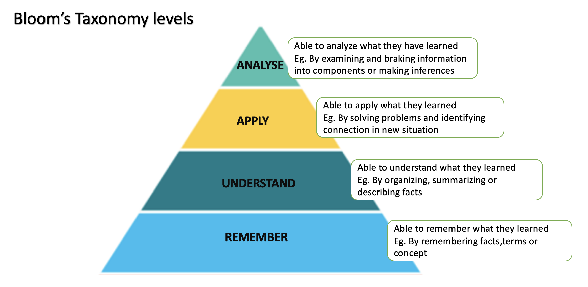

# Scoring System - Rewards & Skill levels

## Two System Approach

GITS has two scoring systems: The skill level system and the reward system. The skill level system is used to determine
how well a user knows a content.
The reward system is used to motivate the user to learn new content and repeat old content.

## The reward system

There are five different types of reward scores:

- Health
- Fitness
- Growth
- Strength
- Power

The reward scores are used to reward the user for completing certain tasks and are visualized with the IT Rex in the
front end.
Health and fitness provide more of a short-term motivation, while growth, strength and power are more long-term rewards.

This section describes how the reward scores are increased and decreased depending on the user's progress.

### Health

> Health shows the current learning progress of a student. If the IT-REX is doing poorly, this is the indicator that the
> student is lagging behind

<small><i>cited from the GITS paper</i></small>

The health score represents how well the user is up-to-date with the content.
It is decreased if the user is behind with the content and increased if the user learn new content that is due.


<details>
<summary><b>Detailed calculation</b></summary>

In detail, the health score is calculated in the following way:

- The health score is a number between 0 and 100.
- If the user has progressed through all content that is due at the current date, the health score is always 100%.
- This is also the case if no content is due at the current date.
- Otherwise, the health score decreases every day until the user is up-to-date again.
- For each content on the critical path, the score is decreased by the number of days the user is behind.
  - The number of days behind is the difference between the current date and the suggested start date of the content in
    days plus one.
- The sum of all decreases multiplied by some factor, which we set to 0.5 for now
- The maximum decrease per day is capped at 20%.

This results in the following formula:

> healthDecrease(contents)= min(20, 0.5 ⋅ ∑<sub><em>c</em> ∈ contents</sub>(today − <em>c</em>.startDate + 1)

Examples:

- If the user is 7 days behind to learn 2 contents, the health score will be 100 - 7 - 6 - 5 - 4 - 3 - 2 - 1 = 72%.
- If the user is 7 days behind to learn 4 contents, the health score will be 100 - 14 - 12 - 10 - 8 - 6 - 4 - 2 = 44%.
- If the user is 14 days behind to learn 1 content, the health score will be 47.5%.
- The earliest the user can reach health 0% is 5 days behind (with 40 contents overdue)


To regenerate health, the user has to progress through new content.
If he does so, the health will regenerate by x% where x is the missing health to 100% divided by the number of contents
the user is behind (before they progressed the new content).

For example if the user has 70% health and has to learn 2 contents to be up-to-date again, he will regenerate 15%
health (100 - 70 / 2) when he progresses through one content. If he progresses through both contents, he will regenerate
30% health (100 - 70 / 1) and will be back to 100% health.

> healthRegen(health, contentsBehind) = (100 - health) / #contentsBehind

#### Possible parameters to change

| Parameter              | Description                                       | Default value |
|------------------------|---------------------------------------------------|---------------|
| Health decrease factor | The factor applied to the health decrease per day | 0.5           |
| Max health decrease    | The maximum health decrease per day               | 20%           |

</details>

### Fitness

> Fitness shows how well a student repeats previous chapters. For example, if the IT-REX is limp, the student has to
> repeat old chapters and “train” so that the fitness increases. Furthermore, tests that the student did not solve
> correctly are repeated more frequently

<small><i>cited from the GITS paper</i></small>

The fitness score represents how well the user repeats old content.
It is calculated similar to the health score, but only considers content that is due for repetition
and also takes into account the correctness score of each content.

To understand how the fitness score is calculated, we recommend to
read [the spaced repetition page](spaced-repetition.md) first.


<p></p>
<details><summary><b>Fitness score calculation</b></summary>

For the fitness score, **we only consider contents that are due for repetition**.

The fitness score is calculated in the following way:

- If no contents are due for repetition, the fitness score is always 100%
- For each content that is due for repetition, the score decreases by `1 + (2 * daysOverdue *  (1 - correctness^2))`
  where
  - `daysOverdue` is the number of days the content is overdue for repetition, starting at 1 if the learning date is
    today
  - `correctness` is the correctness of the content. It is squared to make the decrease more significant for contents
    with low correctness.
- The maximum decrease per day is capped at 20%.

This way, the fitness score will decrease more if the user has a lot of content to repeat and the correctness is low. If
the user has contents to repeat with high correctness, the fitness score will decrease more slowly.

This results in the following formula:

```
fitnessDecrease(contentsToRepeat) = min(20, sum of contentsToRepeat (1 + (2 * daysOverdue * (1 - correctness^2))))
```

Examples:

- If the user gets 10 contents to repeat with a correctness of 95% at the current date, the fitness will be ~96%.
- After seven days, the fitness will be ~37%.
- If the correctness of those contents had been 50%, the fitness after one day would be ~83% and 0% after just six days.
- If a user has one content due by 30 days with a correctness of 99%, the fitness score would be reduced to around 51%.

Plots:


To regenerate fitness, the user has to repeat old content.
If the user repeats a content that he is not due according to the spaced repetition algorithm, the fitness will
regenerate by 1% if he repeats it correctly.
This way, the user is encouraged to repeat content he is already good at, because it will regenerate his fitness score,
even though slowly.
We want to keep it that low, because we don't want the user to repeat content that he is already good at too often.
Also, the user will not gain fitness if he repeats content more than once a day.

If the user repeats a content that he is due for according to the spaced repetition algorithm, the fitness will
regenerate by the following formula:

```
fitnessRegen(fitness, contentsToRepeat, correctnessBefore, correctnessAfter) 
= (1 + correctnessAfter - correctnessBefore) * (1 - fitness) / contentsToRepeat
```

This means that fitness is regained similarly to how health is regained, but the amount of fitness regenerated is
additionally multiplied by a factor that depends on the correctness before and after the repetition.

If the user repeats content unsuccessfully, the fitness score does not change.

Examples:

- If the user has a fitness of 90%, repeats one of two contents, and repeats it with the same correctness as before, the
  fitness will be 95%.
- If the user has a fitness of 90%, repeats one of two contents, but increases the correctness from 50% to 100%, the
  fitness will be 97.5%.
- If the user has a fitness of 90%, repeats one of two contents, but decreases the correctness from 100% to 50%, the
  fitness will be 92.5%.
  - 50% might be too low that the assessment or content is considered successful, so this might not be a realistic case.

</details>

### Growth

> Growth serves as a progress bar, so the students know how much of the course is still ahead of them. The IT-REX
> receives food with each new concept learned. Therefore, it grows and moves up in levels. An upper limit for the levels
> indicates the end of the course that the student is aiming for.

<small><i>cited from the GITS paper</i></small>


Each content has a growth reward score.
This score must be at least 0 but has no upper limit.
The total growth score that can be achieved is the sum of all growth reward scores of all contents.
The progress bar is then calculated by dividing the current growth score by the total growth score.
We purposely do not constrain the growth score between 0 and 100% because we want to give the course creators the
freedom to decide how much growth a content should give.
If a content has a reward score of 100.000, the user might feel more rewarded than if the content only has a reward
score of 10, even though both might be 10% of the total achievable growth score.

The growth score can not decrease.

### Strength

> Strength is used to enforce a certain level of interaction between the students and aims at motivating them to
> participate regularly in REX-Duels: By participating in REX-Duels, the IT-REX gets strength points that depict how a
> student’s knowledge level is compared to others. While both participants increase their IT-REX’ strength points in
> a REX-Duel, the winner will gain significantly more strength points which aims at motivating students to prepare for
> REX-Duels by learning regularly

<small><i>cited from the GITS paper</i></small>


For now, we focus on scores that are not based on the competition with other students, but only on the progress of the
user.
But this score will likely have no upper limit, so that the user can always improve his strength score by competing with
other students.
This score will also not decrease.

### Power

> Power shows the composite value of the other properties so that a ranking of students can be created.

<small><i>cited from the GITS paper</i></small>


```power =  (growth + strength) + 0.1 * (health + fitness) * (growth + strength)```

The power is calculated by adding the growth and strength score.
The student gets a bonus on the power score if he has a high health and fitness score, up to a maximum of 20%.

## The skill level system

While the reward system is used to motivate the students to learn, the skill level system is used to reflect the skills
of the students.
There are four categories of skills:

- Remember
- Understand
- Apply
- Analyze


<small><i>cited from the GITS paper</i></small>

### Skill Types

#### Remember

> In skill level assessment, "Remember" represents the lowest level of cognitive skills.
> When a user demonstrates a skill level of "Remember" after an assessment, it means they are able to recall or recognize previously learned information.
> Users at this level can remember facts, definitions, or concepts presented in the assessment. Their understanding might be limited to basic memorization, and they can identify key terms, dates, or events.

#### Understand

> "Understand" is the next level of cognitive skills in skill level assessment.
> If a user's skill level is classified as "Understand" after an assessment, it means they can comprehend the meaning and significance of the information presented in the assessment.
> Users at this level can explain ideas or concepts in their own words and demonstrate an understanding of how different pieces of information relate to one another.

#### Apply
> Moving up the cognitive skill ladder, "Apply" represents a higher level of skill in skill level assessment.
> When a user has an "Apply" skill level after an assessment, it means they can use their knowledge and understanding to solve problems or apply the concepts they have learned to real-world situations.
> Users at this level can demonstrate practical application and use their learning in new contexts, going beyond simple regurgitation of information.

#### Analyze

> "Analyze" is the highest level of cognitive skills in skill level assessment.
> If a user's skill level is categorized as "Analyze" after an assessment, it means they have the ability to break down complex information into its component parts, identify patterns, relationships, and underlying principles.
> Users at this level can critically evaluate information and draw conclusions based on evidence and reasoning.


### Calculation of the Skill Level Score

In this section we will explain how the skill level score is calculated.
For each skill category the calculation is the same, the skill category in which points are gained is configured per assessment.

* For each skill type (remember, understand, apply, analyze) in each chapter (that contains at least 1 assignment) of a course a user can have a level/rank ranging from 0 to 10
  - 0 means the user has not aquired any skills in the topic(s) of the chapter yet
  - 10 means the user has achieved all aquirable skills of the chapter.
* Each assessment has a set amount of skill points for a skill type that the student will gain upon successful completion
* The skill points for each assessment within a chapter define their relative contribution to the student reaching that chapter's maximum skill level

**ATTENTION**: The logic defined above results in two assignments with the same amount of skill points that are located in two different chapters not necessarily having to contribute the same amount of levels to their respective chapters' skill levels.

E.g. if a chapter has 2 assignments with 1 skill point each, each assignment will contribute 5 levels to the skill level. If another chapter has 1 assignment with 2 skill points and another with 1 skill point, the 1 point assessment will contribute 3.3 levels to the skill level.

### Assessments' Rewarded Skill Points Calculation

* Each time a student works on new content or content that is due for repetition, their skill levels are updated.
* For content which needs to be repeated the student can only reach the full amount of skill points when the student has repeated the content the necessary amount of times
* To prevent users "binge repeating" an assessment, the skill points are not modified if the student repeats content that is not due yet for repetition.

The student receives as many skill points as defined in the assessment,
but with the following modifiers:

* -10% for each hint used, but no more than -40%
* Multiplied by the correctness
* Multiplied by the current repetition relative to the required no. of repetitions
* If the assessment was timed, -5% for each 1% over the time limit, but if more than 10% over the time limit, the student receives 0 skill points
* "Passing" the assessment (i.e. by reaching a minimum correctness or similar) is not required to receive skill points. This is to show the student their progress even if they are not yet able to solve the assessment satisfactorily

The modifiers are applied multiplicatively, so if a student does an assessment the second of three required times, has a correctness of 60%, used one hint, and was 5% over the time limit, they will receive (2 / 3) * 0.6 * 0.9 * 0.75 = 0.27 = 27% of the full skill points of the assignment.
