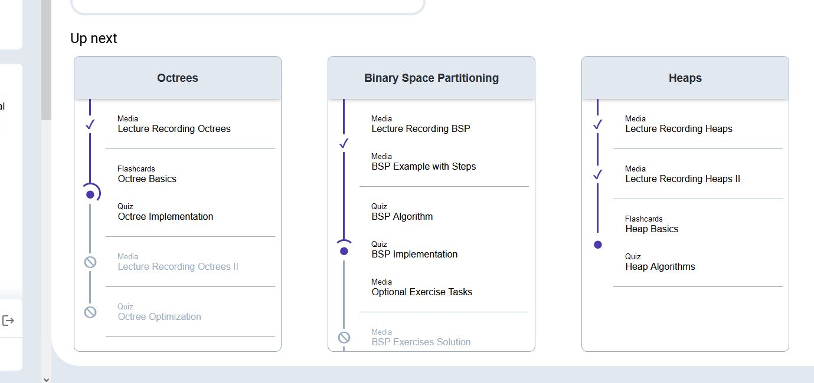

# Concept for a Non-Linear Curriculum

To provide a freer and more dynamic learning experience, one goal is to move away from linear curriculum structures, where one topic just follows another one and the student needs to complete the previous topic to move on to the next, even when the topics do not build upon each other.

An initial request of the customer was to allow the creation of course curricula in which contents can be connected arbitrarily in a graph-like fashion.

After a lot of discussion, the dev team concluded that allowing completely free-form graph designs for the course curriculum is a bad idea for the following reasons:

- sensible graph curricula are hard to create
- It's hard for students to see "where they are" at a glance in a graph with multiple current working heads
- it's hard to maintain/change a graph curriculum
- A good visualization (i.e. a graph) takes up a lot of screen space and is overwhelming in general to students and especially lecturers when creating the curriculum (not everyone's a computer scientist and likes directed graphs!)
- Having to think too hard about how to progress in the curriculum is not desirable. It's demotivating when you have to spend time and brainpower to think about what you need to do instead of just "getting it over with" (There's a reason why modern computer games hand-hold the players! Players don't want to think, they want to feel like they achieved something)
- Using a graph may hinder adding other features later down the line: E.g. it is extremely hard to compute a **human-understandable** metric of progression in a graph that can have arbitrary connections
- The full potential of a truly arbitrary graph will most likely never be taken advantage of by the curriculum designers
- Our alternative suggestion (see below) only slightly reduces freedom in curriculum design while simultaneously significantly reducing the complexity of the curriculum path for students and maintainers of the curriculum

## Alternative Concept

In the end, the dev team settled on the following concept, which in our opinion provides a good balance between ease of use and freedom in designing a curriculum:

* A course consists of (multiple) *chapters*. Chapters can only be progressed linearly. Whether a chapter is available is decided by the settings set by the lecturer (chapter start-/endDate and publish status)
* Each chapter contains one or more *topics*. In our opinion, topics contained in the same chapter should be able to be worked on by the student without any dependence on each other (i.e. you *do not* need to complete one topic before you can move onto the next, you can work on topics in a chapter in arbitrary order. Topics within a chapter should not require knowledge of other topics in the same chapter.) However, it should be discussed with the customer whether they think the system allows sufficient flexibility with this constraint. Otherwise, this constraint can be removed.
* *Within* a topic, a progression is defined by splitting up the topic into multiple *stages*. A stage consists of one or more pieces of content (media, quizzes, flashcards etc.). A student can only progress to the next stage when the previous stage is completed
* What counts as *completed a stage* can be arbitrary! As the decision whether a stage is completed is only dependent on that stage's contents, decision options can be added to the software which can be as simple ("all content pieces need to be finished to complete the stage") or as complicated (minimum average correctness score overall contents, minimum correctness score per content or even going as far as allowing custom boolean expressions to decide completeness) as is desired.

The big positive with this system is that all "non-linearity" and decision-making about progression ("what counts as done?") happens completely on a local basis within each stage. For the "bigger picture" in the topic it is irrelevant whether a specific stage counts as "finished" or not. This has advantages both for the students (a clear progression is visible while still allowing the student to choose *how* to progress in each step of their learning process) and lecturers (simpler creation of a curriculum)

*Basic concept as taken from a UI mockup*

