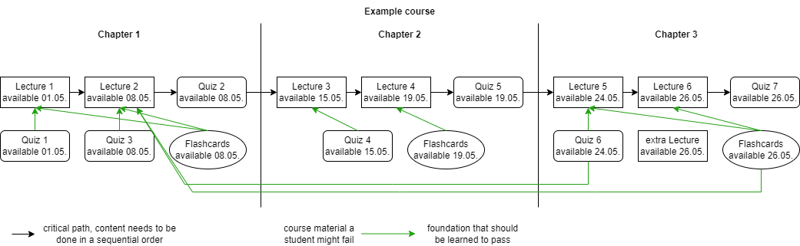

# Content dependency service

This service can be used by the lecturer to annotate non-trivial dependencies between content, that are not already visible in the course service.
It allows the system to suggest to a student what he needs to learn as a foundation for a quiz or game he just failed.  
Example of how additional dependencies in a course might be structured:
