# User Guide for Lecturer
### Introduction:
In this section we explain how a lecturer can use the application.

In the Dashboard, lecturers have the capability to create new courses or modify existing ones. Within each specific course, instructors can also add corresponding chapters, sections, and various types of content such as media, quizzes, and flashcards during the course creation process.
### Add Course
Via the 'Add course' button on the dashboard the lecturer can create a new course by entering following details:
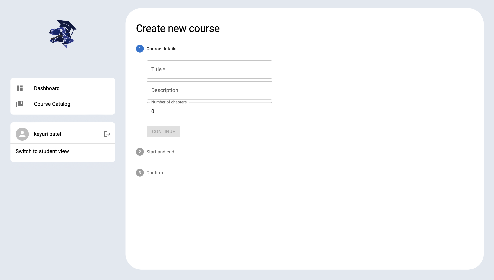
1. In course details, lecturer has to enter Title, description and number of chapters as they want.
2. Start Date, end date and semester.
3. And by clicking on 'Confirm' the course is created successfully after clicking on "Create Course" button. Lecturer can also publish course or by disabling this option he or she just creates the course without publishing.
   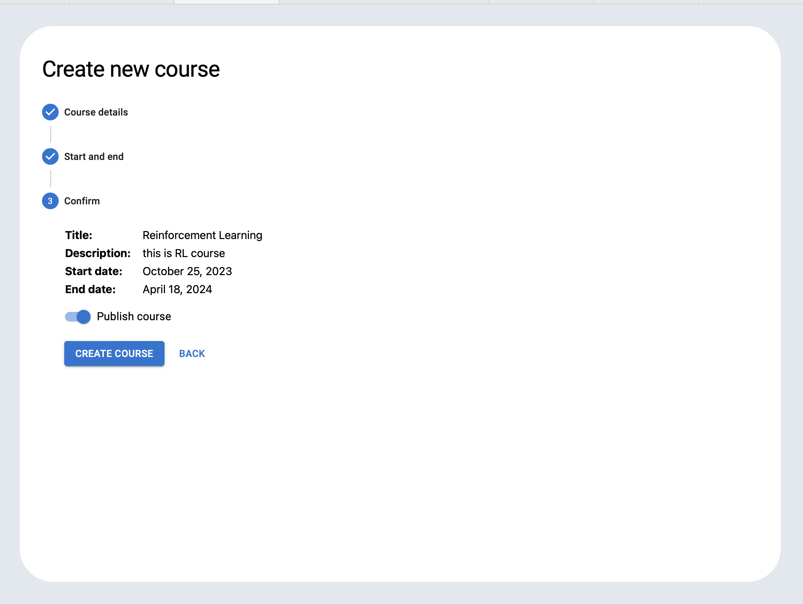
### Add Chapter details
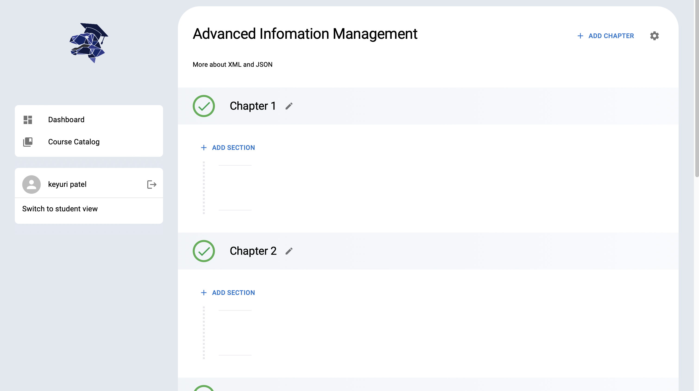
1. After adding a course the lecturer can create new chapters and modify existing ones. For example, he can set start and end dates along with other settings.
2. Lecturer Can enter the details of chapters like adding section and contents of particular chapter.
3. Lecturer can also modify course details from this page.
   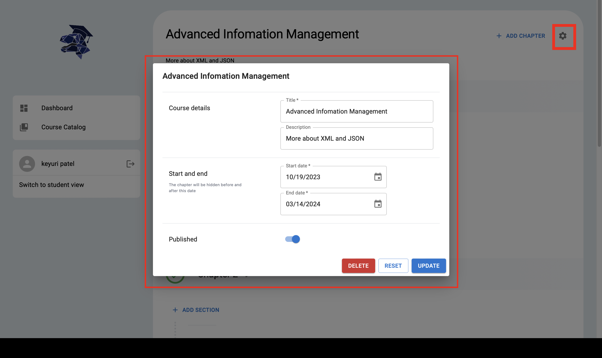

### Add section and Content
1. Lecturer can add a section via "ADD SECTION" button.
   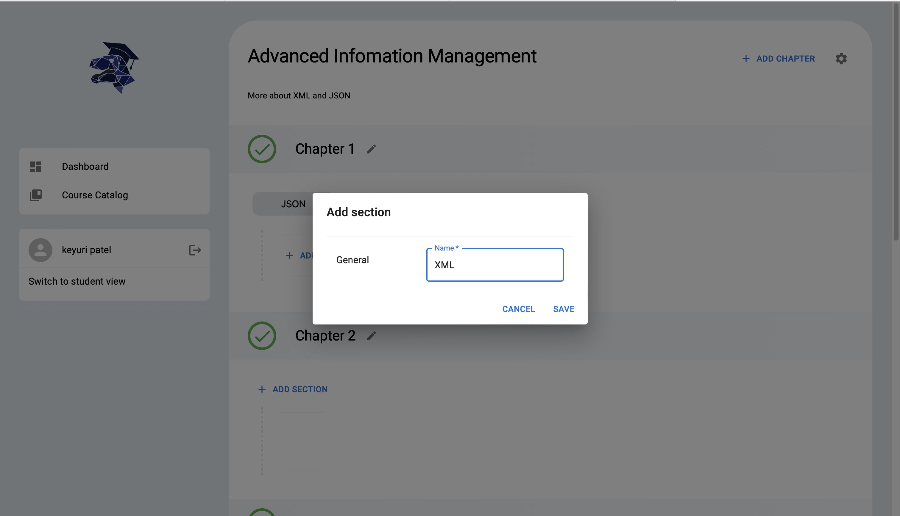
2. After adding a stage via "ADD STAGE" to a section, lecturer can create content via "ADD CONTENT".
3. With that option lecturer can add various types of content like Quiz,Flashcard or Media.

   3.1  ADD FLASHCARD
    - Before creating the flashcard, the lecturer has to fill out the required details for the flashcard, as seen here.
      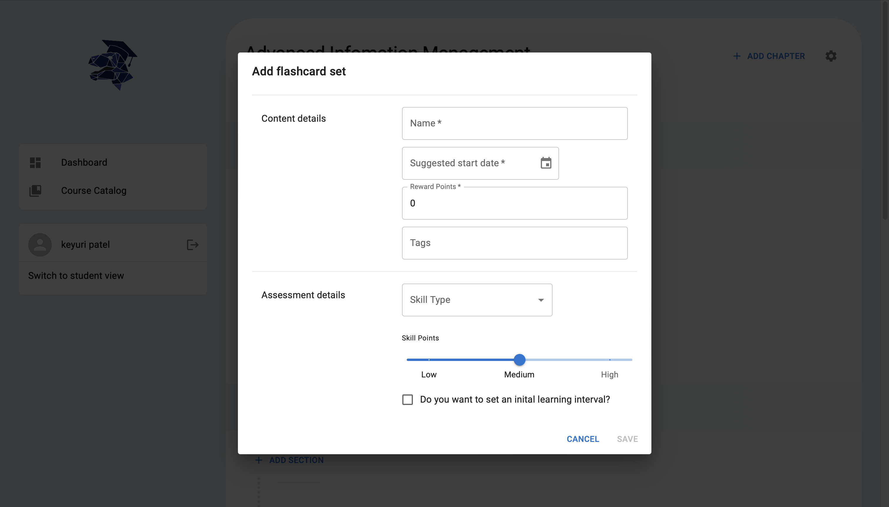
    - After clicking on "SAVE" flashcard is created successfully.

   3.2  ADD MEDIA
- By adding Content details like name, date reward point and tags(optionally).
- By adding media via "ADD MEDIA", lecturer can select media of any type like images, pdfs and videos etc.
  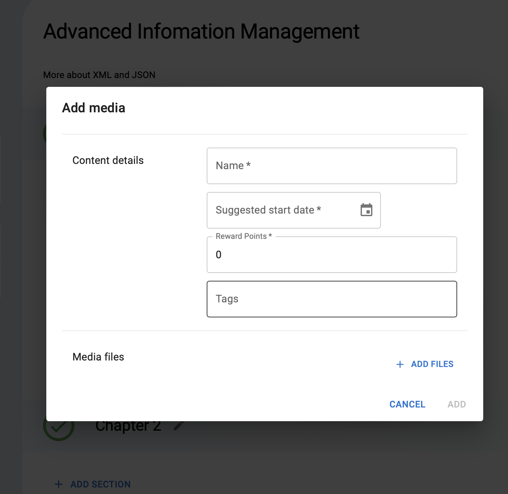
- And on clicking "ADD FILES" lecturer can upload files.
  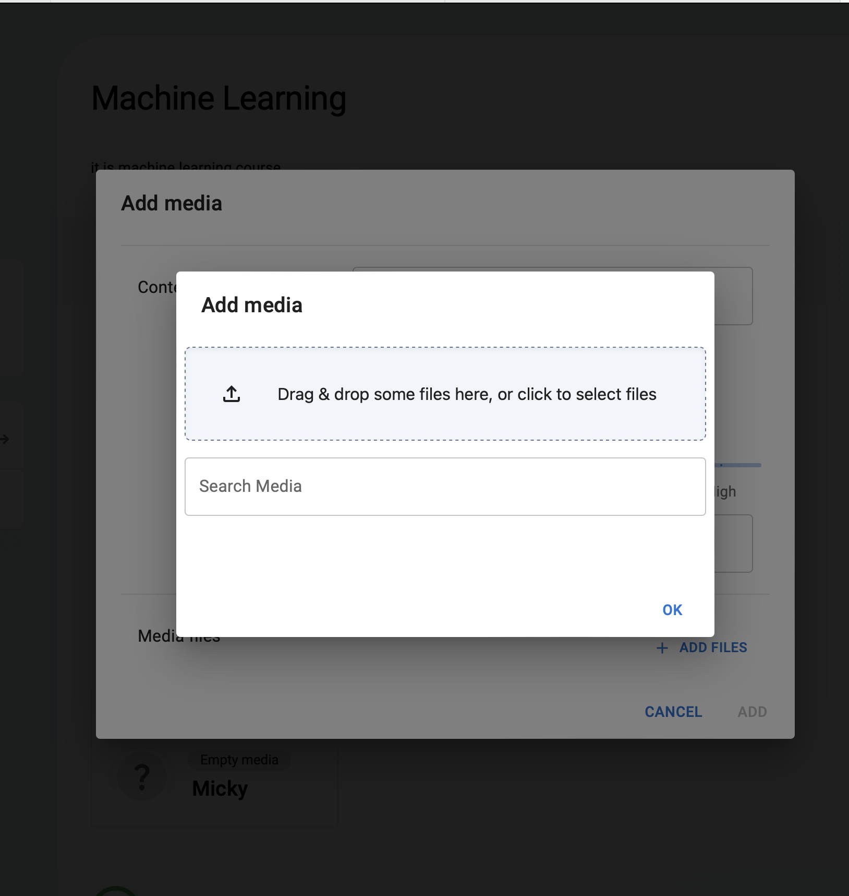

3.3  ADD QUIZ
- Provide the quiz's information related to the content.
  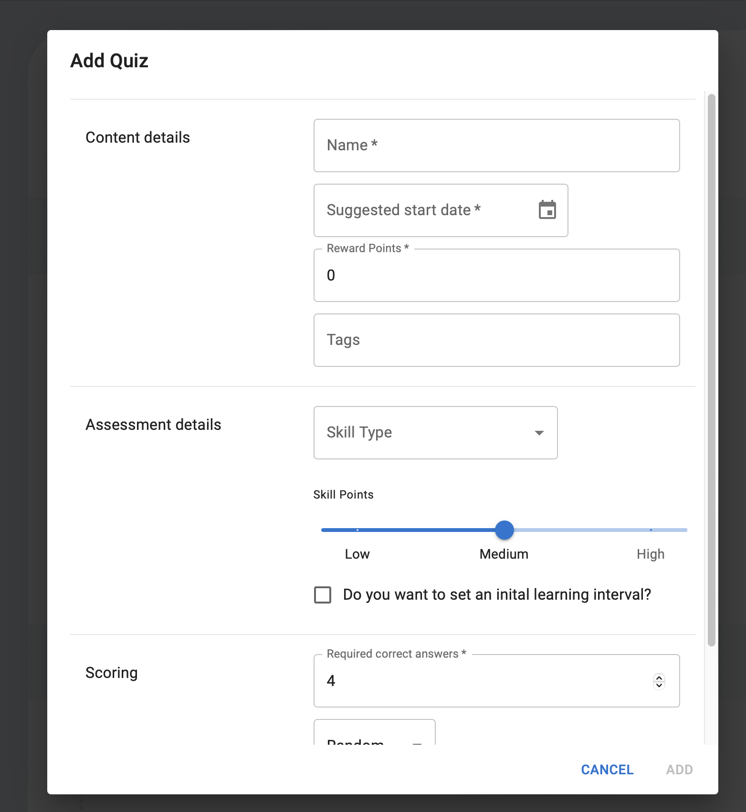

### Add contents details (MEDIA, FLASHCARD, QUIZ)

After adding flashcards, media and quiz lecturer can further add details in flashcard, quiz or media what he created.

#### Flashcard Details
1. Add flashcard by clicking on "ADD FLASHCARD".
2. Add Sides of flashcard.As a side lecturer can create question and answer of that particular Flashcard.
   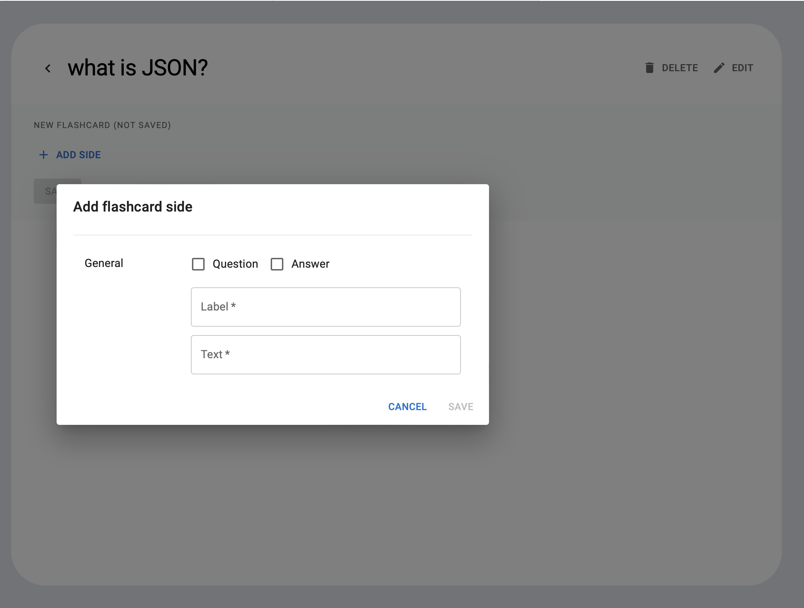
3. Flashcards and their sides are deletable.

#### Media Details
1. After adding media, lecturer can see that uploaded content by clicking on particular uploaded content and he or she can see that content, even delete and edit option is also there.

#### Quiz Details
1. Add question to the quiz by "ADD QUESTION".
2. For the question type, 3 options are given:
   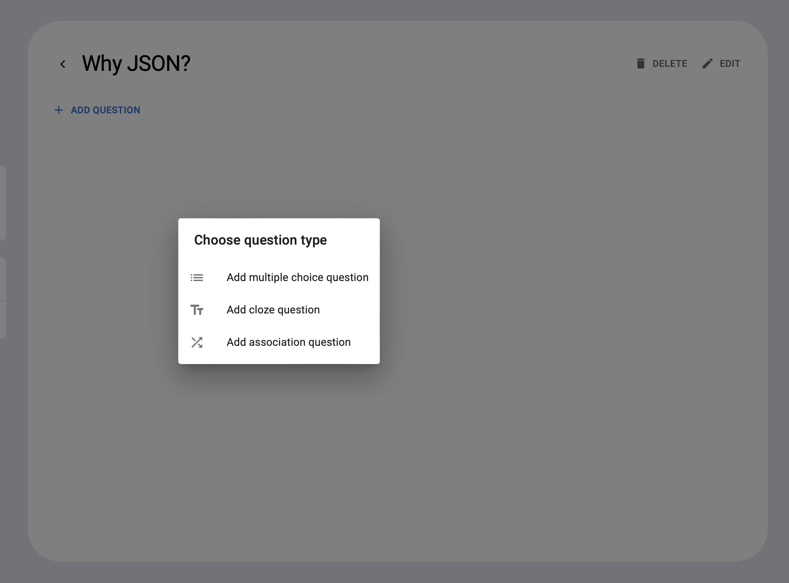

- **Multiple Choice Question:** :
  Students have to select all the correct answers from the available options.
    - Fill the required details like question, hint etc.
    - By clicking "Add", multiple choice question will be added.
      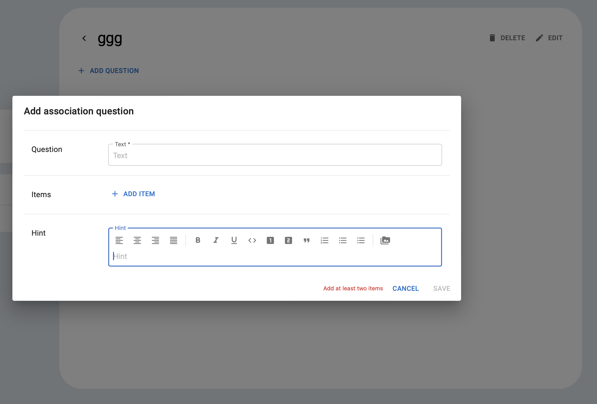
- **Cloze Question:**
  Fill in missing words in a sentence.
    - lecturer can add the cloze question by adding required details shown in the Image.
      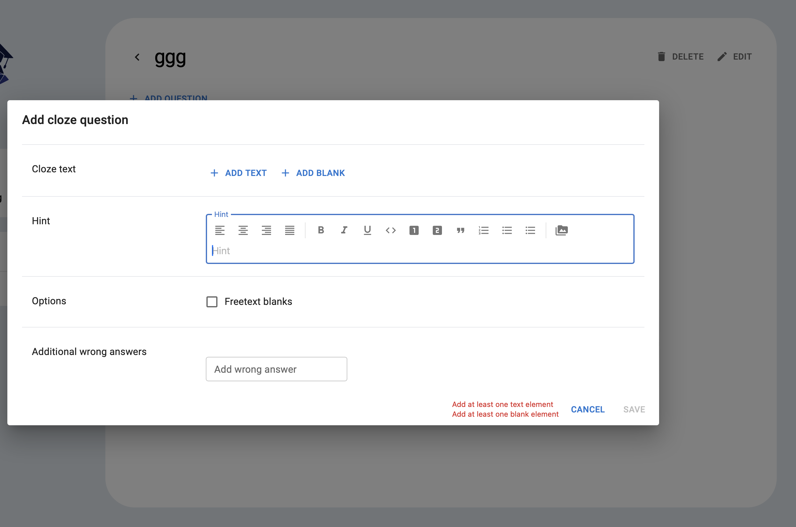
- **Association Question:**
  Match related concepts or items.
    - In assosication question lecturers can create question-answer pairs for assessments.
      
### Join as Lecturer
After creating the course the lecturer is automatically added as the administrator to the course.

### Upgrade members in a course
An administrator of the course can set the roles of all users of a course on the members site. The members sites is accessible through the course page, where you can find the button in the top right corner, where also the settings of the course and the "Add Chapter" button are.
The administrator can set the users to be students, tutors or administrators.

