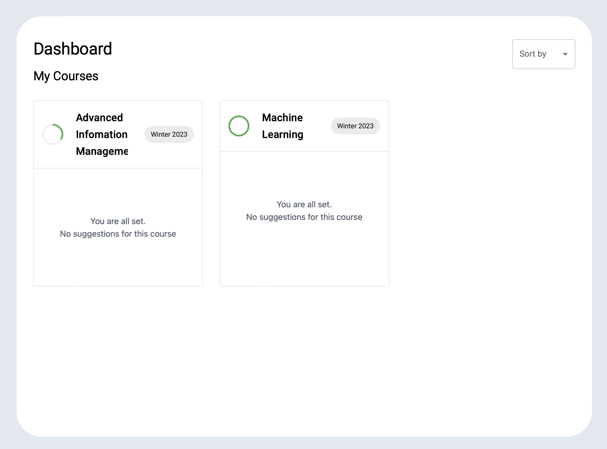
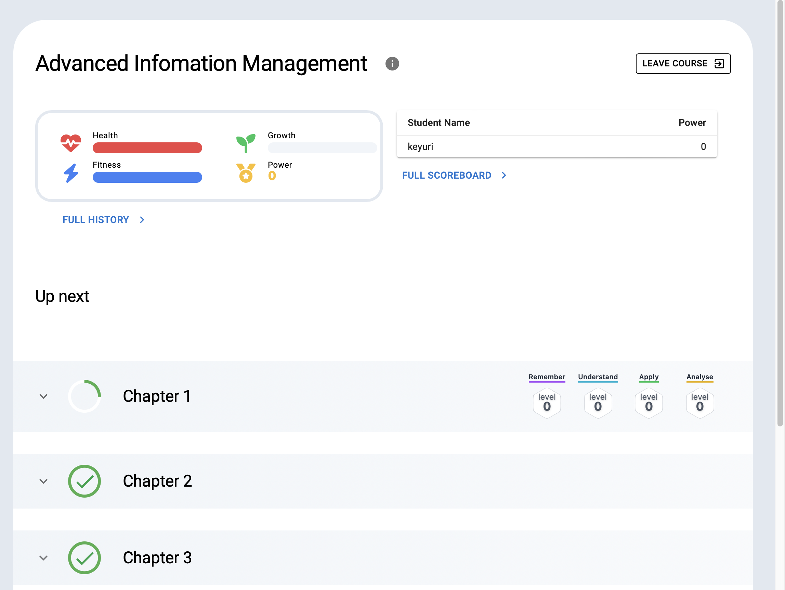
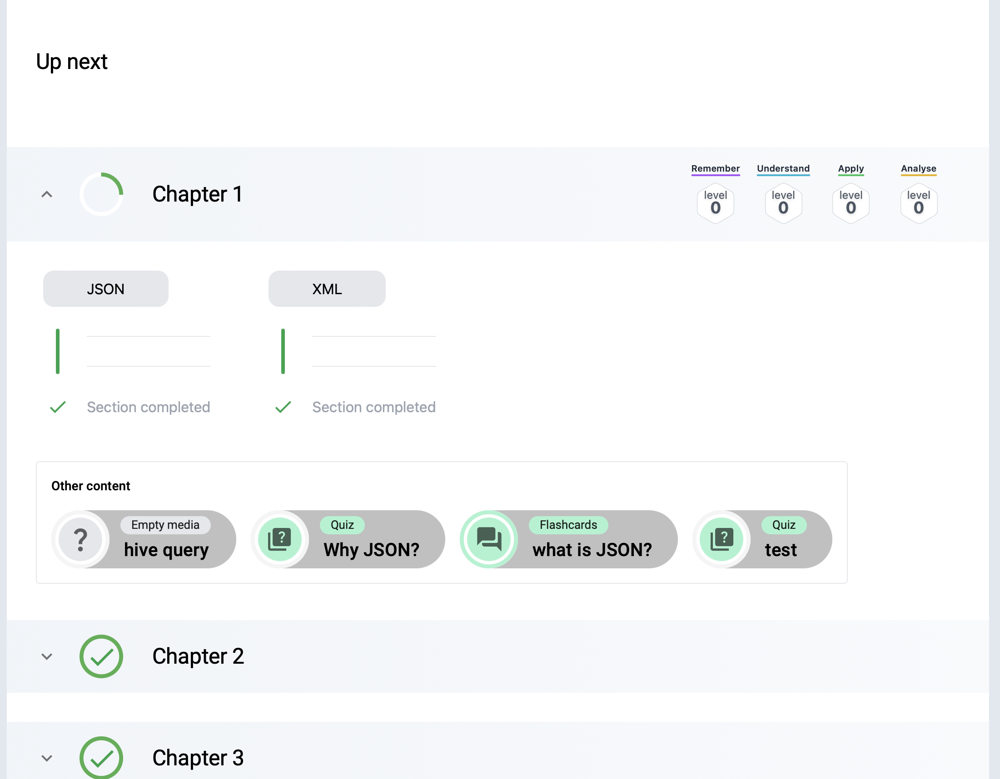
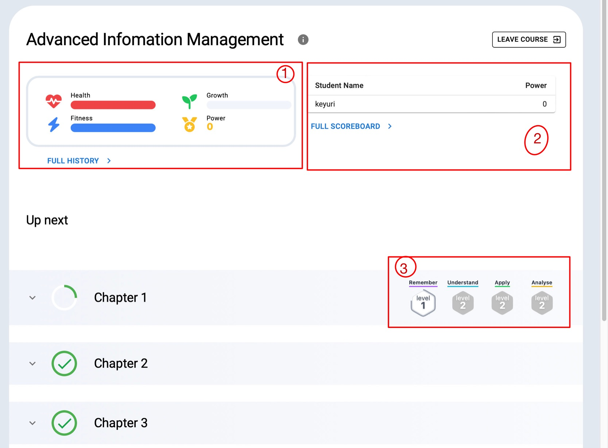

# User Guide for Student
## Introduction
This view is for students and in it they can register/deregister for courses and learn.
After each assessment students can gain or lose points.

GITS (Gamified intelligent tutoring system) has two scoring systems: The skill level system and the reward system. The skill level system is used to determine how well a user knows a piece of content. The reward system is used to motivate the user to learn new content and repeat old content.
## Join Course
After login, Students can find different courses in the course catalog and join them.
## Access registered courses
1. After joining courses, students can see them with the information in which year and semester they take place on their dashboard 
2. Access particular courses by clicking on that course.
3. Once the student opens a specific course, it looks like this:
   
## Scoring system
1. Students can earn points for every piece of content they learn and for every assessment they complete.
   
2. After each piece of content or assessment the score is updated and students can compare themselves to their peers by looking at the scoreboard.
   

- Students can see their reward scores as bars on the top left (1):  [ Reward system concept](https://gits-enpro.readthedocs.io/en/latest/dev-manuals/gamification/Scoring%20System.html#the-reward-systemHere)
    1. Health
    2. Power
    3. Fitness
    4. Growth
- Student can see the full history and what caused changes in their score by clicking on "FULL HISTORY" beneath the scores.
- Next to the reward scores on the right (2) is the scoreboard where students can compare their score to other students. By clicking on "FULL SCOREBOARD" students can see the entire scoreboard, not just the preview. The score shown in the scoreboard is the power score which is a combined score of all three other reward scores.

- After each assessment students can also see their skill level, which shows how well a student knows the content of each chapter. For more detail on the skill levels see: [ SkillLevel Concept](https://gits-enpro.readthedocs.io/en/latest/dev-manuals/gamification/Scoring%20System.html#the-reward-systemHere).

- Skill levels (4) according to the blooms taxonomy are there:
    1. Remember
    2. Understand
    3. Apply
    4. Analyse

  and under each skilllevel badge, students can see their score.

3. Students can also leave this course by clicking on the "Leave course" button.
